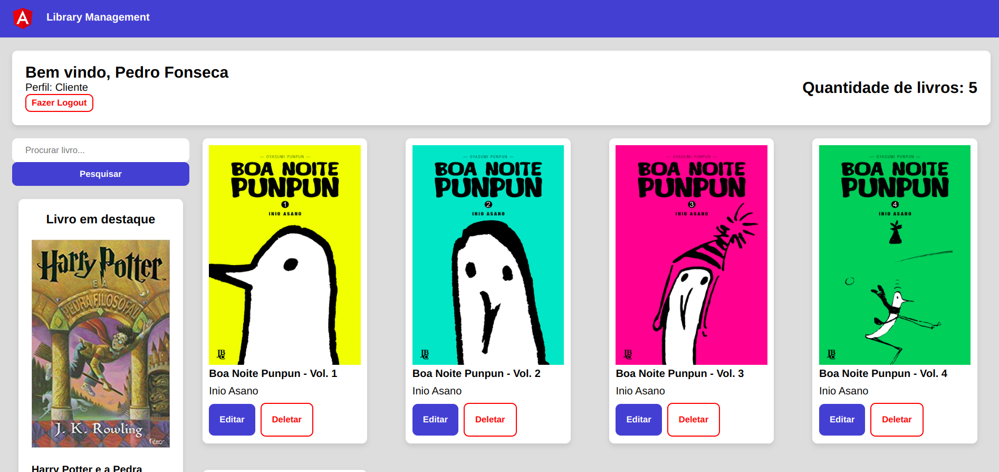

# Library Management

<p align="center">
  
</p>

## Informações iniciais 
Este repositório é um desafio para a empresa Techlead, para desenvolvedor frontend, onde foi composto de três etapas sendo elas definidas abaixo

### Desafio – Nível 1
- Deve conter uma tela inicial de login.
- Na tela de login deverão existir links de cadastre-se e esqueci minha senha para que
novos usuários possam ser cadastrados e antigos usuários possam recuperar o acesso.
- Esse cadastro será sempre de usuário do perfil cliente, já o perfil administrador
deve ser persistido diretamente no banco de dados, assim que a aplicação subir.
- O usuário de perfil administrador terá uma tela de gerência de livros, no qual ele
poderá cadastrar / editar / excluir / listar / detalhar os livros.
- O usuário de perfil cliente terá uma tela que poderá consultar a lista completa de
livros, podendo cadastrar novos livros, no entanto, editar e excluir somente aqueles cadastrados
por ele.

### Desafio - nível 2
- Adicionar funcionalidade de empréstimo dos livros de acordo com regas abaixo:
a. Um usuário comum do sistema deverá solicitar o empréstimo selecionando o
livro desejado em uma área de “solicitações de empréstimo” no sistema.
b. Ao solicitar o empréstimo, o sistema deverá validar se o livro solicitado está em
estoque e disponível para empréstimo.
c. Ao realizar um empréstimo, deverá ser especificado de quantos dias será o
empréstimo.
- Adicionar ao sistema o perfil de bibliotecário, o qual será responsável por gerenciar
os empréstimos dos livros
a. O perfil será responsável por aceitar as solicitações de empréstimo, informar
quando uma devolução for realizada e ver os empréstimos que estão em
andamento.
- Executar penalidade em situações de atraso de entrega e perda/danos referentes aos
livros de acordo com as seguintes condições
a. Em caso de atraso inferior a 10 dias, o usuário fica impedido de realizar novos
empréstimos por 2 dias.
b. A partir de 10 dias de atraso, o usuário fica impedido de realizar novos
empréstimos por 1 semana, incrementando mais 1 semana a cada 10 dias de
atraso (Exemplo: de 10 a 19 dias de atraso, 1 semana de penalidade; De 20 a 29
dias de atraso, 2 semanas de penalidade), com no máximo 4 semanas de
penalidade.
c. Em caso de perda ou dano de livros, o usuário terá penalidade de 1 mês sem
poder realizar novos empréstimos assim como terá seu acesso bloqueado por 1
semana.

### Desafio - nível 3

- Adicionar no sistema localização física dos livros. Os mesmos devem conter um
campo chamado estante, identificando onde se encontra o livro desejado.
- Adicionar filtros de pesquisa para os usuários, de forma a facilitar com que os
mesmos encontrem os livros desejados.
- Disponibilizar endpoint no backend que deverá realizar a carga dos livros na base
de dados, deverá consumir um JSON contendo as informações dos mesmos e realizar as
inserções no banco.
a. Esta carga deverá realizar inserção de novos livros, assim como atualizar
informações como quantidade de livros em estoque, gênero e localização física
b. O sistema deverá ter uma rotina programada para as 20h de segunda a sexta e
às 22h de sábado e domingo que informe ao usuário com perfil de administrador,
via email: A quantidade de livros emprestados, a quantidade de livros em
estoque e a quantidade de livros com entrega atrasada.

 - Disponibilizar contagem de tempo no sistema iniciando a partir do momento do
empréstimo do livro seguindo as condições abaixo:
a. Para o perfil de cliente, o sistema deverá disponibilizar na tela de detalhes do
empréstimo, um contador em tempo real de quanto tempo falta para a devolução
e notificar o usuário de devoluções atrasadas sempre que o mesmo entrar no
sistema
b. Para os perfis de bibliotecário e administrador. Deverá existir um contador em
tempo real indicando o tempo restante para as devoluções, assim como uma
opção de notificar manualmente o cliente, podendo ser enviado um texto
digitado pelo administrador/bibliotecário.

## 💻 Tecnologias utilizadas
- Angular.js
- Css
- Json-server

## 📁 Instalar o repositório

### Clone o Repositório:

```
git clone https://github.com/MarceloCChaves/Library-Management.git
```

### Instale as Dependências:

```
  npm install
```

### Para inicializar a aplicação use o comando

```
  ng serve
```

### Para iniciar o json-server, siga os seguintes passos:
- Navegue até a pasta src/app/backend
- Inicialize com o comando:

```
  json-server --watch db.json
```

## 👨‍💻 Autor

<a href="https://github.com/MarceloCChaves">
 
 <br />
 <sub><b>Marcelo Chaves</b></sub></a> <a href="https://avatars.githubusercontent.com/u/62251064?s=400&u=b1c8da11d91445ccb2d97b709ccbcd0524885d98&v=4" title="Marcelo">🚀</a>


Feito com ❤️ por Marcelo Chaves 👋🏽 Entre em contato!

[](https://www.linkedin.com/in/marcelocchaves/) 
[](mailto:Marcelochaves20000@gmail.com)
